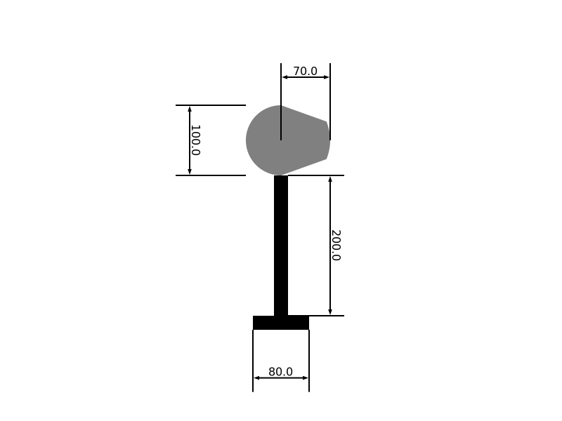
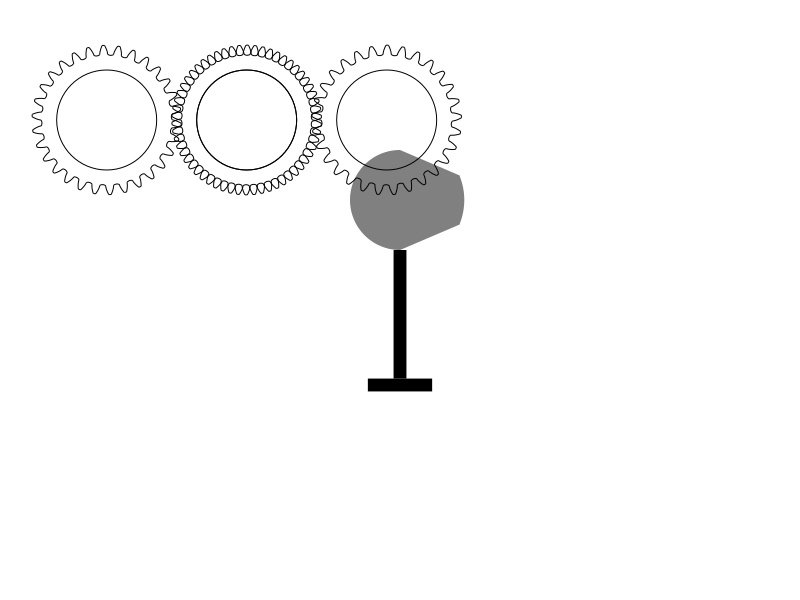

# HOMEWORK 1: Incredible Machines

I'm creating a Cam-Valve sistem.

## DEFINITION OF THE PIECES

### VALVE
The Valve is the piece that moves just in one direction (vertically). It is always in contact with the Cam.

### CAM
The Cam is a ellissoid-like piece that rotates on the axis passing through its center. It makes the valve go up and down.

#### PARAMETERS
If we consider the Cam as en ellipse, it can be defined with two parameters:

* `rMin`: the minimum height the point of contact between Cam and Valve is going to be.

* `rMax`: the maximum height the point of contact between Cam and Valve is going to be.
  
* `lenValve`: the principal length of the Valve

* `diamValve`: the diameter of the base of the Valve

* `Alpha`: the angle of rotation of the cam

* `Gamma`: the angle of the sector of the external circle of the cam

#### CONSTRAINS

1) `rMin` needs to be smaller than * `rMax`: `rMin`<`rMax`

2) The lift of the Valve is defined as the maximum excursion the Valve has. Since the Valve and the Cam are always in contact, the lift of the Valve is equal to: `ValveLift` = `rMax` - `rMin`.
In order for the sistem to be assembled, the lift cannot exceed the valve length: `rMax` - `rMin` <= `lenValve`

Example image:

------

Example image with quotes:

------

### Machine
The machine is made up of a Cam-Valve system, that is moved by a chain of gears. A struct made of a Cam-Valve system and one chain of gears is named "Distribution".

#### Distribution struct:
* `cam`: pointer to a Cam-Valve (ENRICdevice).
* `gearCenter`: pointer to a gear, it's the first gear of the chain.
* `gearLeft`: pointer to a gear, it's the second gear of the chain.
* `gearRight`: pointer to a gear, it's the third gear of the chain.

#### Engine struct:
* `n`: number of distributions.
* `distributions`: array of pointers to distributions struct.

#### Parameters:
Using these parameters, multiple distributions are intialized and stored into the array of the engine struct:
* `n`: number of distributions of the engine.
* `reference_radius`: radius of the gear.
* `axle_radius`: radius of the axle of the gear.
* `teeth`: number of teeth of each gear.

Command format: `./mainentry -"struct" -i importPath -e/-eq/-ea exportPath -p {parameters}`
* `"struct"` must be device or distribution: define which one
* `-i` import a struct from the file with path `importPath`
* `-e` export a struct (`-eq` export with quotes, `-ea` export animated) on the file with path `exportPath`
The struct is taken from:
an imported file called with the option `-i` (prioritized action)"
the one created with the parameters passed after the option `-p` (ignoerd if `-i` is called)"
-`-eq` export a struct with quotes on the file with path `exportPath` (options as before)\n"
-`-ea` export a struct animated on the file with path `exportPath`"
-`p` followed by the parameters of the struct to be exported (can't be called if `-e` or `-eq` isn't called before)"
Parameters: `rMin`, `rMax`, `lenValve`, `diamValve`, `Alpha`, `Gamma` for device,"
`reference_radius`, `axle_radius`, `teeth` for distribution;

Example image:

------